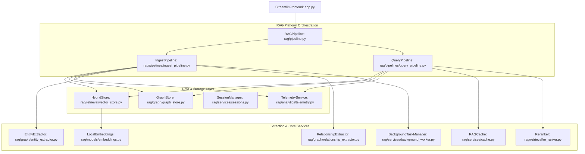

# IntelliGraph-RAG

An enterprise-grade, production-hardened Intelligent Document Assistant platform that integrates hybrid vector-keyword retrieval, cross-encoder re-ranking, adaptive state-graph agentic routing, local Knowledge Graph (KG) indexing, environment diagnostics, asynchronous background execution, and comprehensive analytics & token cost observability.

---

## Project Overview

**IntelliGraph-RAG** is built to solve the retrieval quality, reasoning limitations, and observational blindspots common in basic RAG pipelines. By combining vector embeddings with local topological relationship graphs, it offers a multi-dimensional retrieval space for complex data questions.

* **Hybrid Retrieval** — Fuses semantic search (via FAISS and local SentenceTransformer embeddings) and keyword keyword search (via BM25Okapi) normalizations for comprehensive chunk discovery.
* **Agentic RAG** — Classifies incoming queries and executes adaptive planning loops. For complex queries, it generates sub-questions and evaluates evidence sufficiency before replying.
* **Knowledge Graph Search** — Extracts semantic connections between teams, services, projects, databases, and APIs to resolve multi-hop relational questions.
* **OCR Processing** — Detects scanned PDF pages dynamically and routes them to a local OCR pipeline as a fallback.
* **Table Intelligence** — Extracts structure tables from files and converts them to clean Markdown grids to preserve tabulations for structural analyses.
* **Conversational Memory** — Persists conversation histories locally, automatically compressing the history turns during conversational query rewriting.
* **Analytics Dashboard** — Visualizes database chunk statistics, daily volume trends, and common search phrases using native Streamlit widgets.
* **Cost Monitoring** — Tracks input, output, cached input, and embedding tokens separately with customizable LLM rate configuration panels.

---

## Architecture Overview



For more in-depth architectural details, check out [docs/architecture.md](file:///d:/ongoing/pr-review/docs/architecture.md).

---

## Key Features

* **Multi-Layer Core**: Complete separation of concerns across configurations, services, retrievals, extraction modules, and analytical dashboards.
* **Security Shield**: Filename traversal sanitization blocks directory manipulation, and magic-bytes structure validation rejects modified file formats.
* **Thread-Safe Caches**: Highly optimized memory cache tracks vector lookups and expansions with configurable TTL parameters, clearing automatically when indexes mutate.
* **Non-Blocking Indexing**: ThreadPool executors handle CPU/GPU intensive embeddings generation, OCR, and graph compilation in the background.

---

## Screenshots Section

> [!NOTE]
> Visual dashboard assets and interface frames of the running system.

### Main Chat Interface

*Figure 1: Grounded conversation view with citation references and expandable source cards.*

### Knowledge Graph Explorer

*Figure 2: Interactive 2D relationship topologies, node detail sidebars, and connection filtering controls.*

### Analytics & Cost Dashboard

*Figure 3: Cumulative token cost charts, daily pricing selectors, database statistics, and latency stage distributions.*

### Agent Execution Trace

*Figure 4: Real-time decision logs showing sub-question plans, evidence evaluations, and confidence metrics.*

---

## Technology Stack

* **Frontend UI**: Streamlit 1.32+
* **Orchestration**: LangChain Core, State-based Agent workflows
* **Embeddings**: SentenceTransformers (local CPU/GPU runtime)
* **Vector Store**: FAISS (L2 Semantic Distance) & BM25Okapi Keyword Indexing
* **Graph DB**: NetworkX (Directed Graph representations)
* **OCR fallback**: PaddleOCR & Pytesseract (Optical Character Recognition)
* **PDF Analysis**: pdfplumber & PyMuPDF (layout & table extraction)
* **LLM APIs**: DeepSeek Chat / OpenAI API interfaces
* **Testing**: Python unittest discover suite

---

## Installation Guide

### Prerequisites
1. **Python 3.11+** installed locally.
2. **Tesseract OCR** binaries installed on the host system:
   - **Windows**: Install via vcpkg or download installer. Add installation path to `PATH` environment variables.
   - **macOS**: `brew install tesseract`
   - **Linux**: `sudo apt-get install -y tesseract-ocr`

### Step 1: Clone and Create Virtual Environment
```bash
git clone https://github.com/your-username/IntelliGraph-RAG.git
cd IntelliGraph-RAG

python -m venv .venv
.venv\Scripts\activate      # Windows
# source .venv/bin/activate # macOS/Linux
```

### Step 2: Install Libraries
```bash
pip install -r requirements.txt
```

---

## Configuration Guide

For detailed adjustments of thresholds, directories, models, and LLM pricing rates, read [docs/configuration.md](file:///d:/ongoing/pr-review/docs/configuration.md).

Create your local environment setup file:
```bash
copy .env.example .env
```
Edit `.env` and provide your DeepSeek API key:
```env
DEEPSEEK_API_KEY=sk-your-deepseek-api-key-here
```

---

## Running Locally

To start the local web frontend server:
```bash
streamlit run app.py
```
Open the URL `http://localhost:8501` in your browser.

---

## Docker Deployment

To build and launch the platform using Docker containers:

1. Add your `DEEPSEEK_API_KEY` to the `.env` file.
2. Build and run the image stack:
   ```bash
   docker-compose up --build -d
   ```
3. Open `http://localhost:8501` in your browser.

Local volumes will map `./rag_storage` automatically to persist indexes across container re-builds. Read [docs/deployment.md](file:///d:/ongoing/pr-review/docs/deployment.md) for advanced container settings.

---

## Example Queries

* **Simple Semantic**: *"Explain the PTO carry-over policy details."*
* **Relational Connection**: *"Who owns the Service Alpha gateway?"*
* **Hybrid relational/semantic**: *"List the services connected to PostgreSQL and explain why we use PostgreSQL for them."*
* **Complex Agentic**: *"Compare the security review guidelines of Team Alpha and Team Beta."*

---

## Project Structure

```text
IntelliGraph-RAG/
├── app.py                  # Streamlit UI layers and widgets
├── requirements.txt        # Pinned runtime dependencies
├── Dockerfile              # Multi-stage image build layers
├── docker-compose.yml      # Container service and volume configurations
├── docs/                   # Platform manuals and system guides
├── rag/                    # Modular engine source root
│   ├── config/             # Config schemas and validation diagnostic checks
│   ├── services/           # Cache systems, workers, loggers, and session files
│   ├── models/             # Sentence embeddings and custom LLM client wrappers
│   ├── retrieval/          # Hybrid vector stores and cross-encoder rerankers
│   ├── graph/              # Local NetworkX store, entity & relation builders
│   ├── analytics/          # Telemetry loaders and latency trackers
│   ├── agent/              # State-graph agent planners and evaluators
│   ├── utils/              # Security sanitizers and custom exceptions
│   └── pipeline.py         # Primary RAGPipeline entrypoint coordinator
└── tests/                  # Discover test suite files
```

---

## Future Enhancements

1. **Distributed Graphs**: Support for remote Neo4j graph stores.
2. **Local LLM integration**: Integration with local Ollama runtimes for fully offline private RAG clusters.
3. **Advanced Hierarchy**: Chunking support for hierarchy section trees.

---

## License

Distributed under the MIT License. See `LICENSE` for details.
