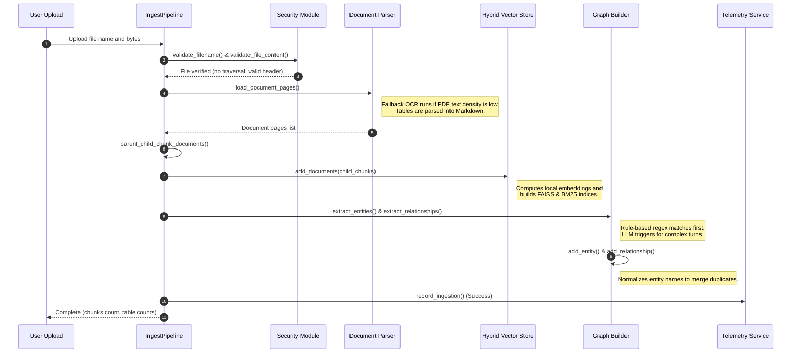
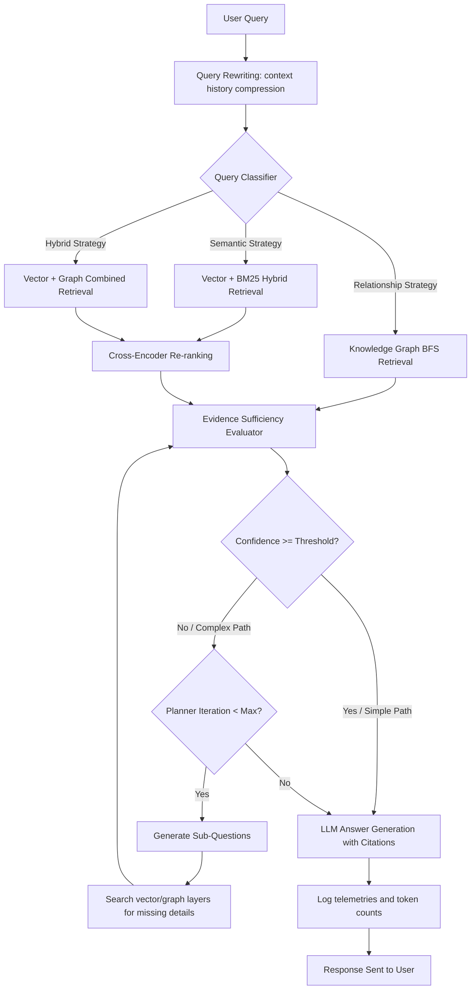

# IntelliGraph-RAG — System Architecture

This document details the layered structure, data pipelines, and workflow orchestration of the **IntelliGraph-RAG** platform.

---

## 1. System Layout Overview

The codebase is organized into modular packages to isolate concerns and enforce boundary constraints between processing stages:

```text
IntelliGraph-RAG/
├── app.py                      # UI Presentation layer (Streamlit dashboard and widgets)
└── rag/
    ├── config/                 # Central settings configurations and env checks
    ├── utils/                  # Safe security checks and standard exception templates
    ├── services/               # Caching, background executors, and file sessions
    ├── models/                 # Neural sentence transformers and token interceptor wrappers
    ├── retrieval/              # Hybrid BM25/Vector databases and rerankers
    ├── graph/                  # Local NetworkX store, entity & relationship builders
    ├── analytics/              # Usage stats and latency trackers
    ├── agent/                  # State workflows planners and sufficiency metrics
    ├── pipelines/              # Segmented ingest and query engines
    └── pipeline.py             # Entrypoint RAGPipeline orchestrator
```

---

## 2. Ingest Pipeline Flow

When a document (PDF, TXT, or MD) is indexed, the Ingest Pipeline processes it sequentially:



---

## 3. Query Pipeline Flow (Agentic RAG)

When a query is submitted, the system adaptively routes the execution based on semantic classification and context evaluations:



---

## 4. Key Architectural Design Decisions

* **Unified API Facade**: `RAGPipeline` (in `rag/pipeline.py`) implements a facade pattern, acting as the single entrypoint for `app.py` while delegating implementation internals to `IngestPipeline` and `QueryPipeline`.
* **State Object Isolation**: State variables are encapsulated within `WorkflowState` and mutated inside individual nodes of the `RAGWorkflow` pipeline, preventing side effects.
* **Synchronized Settings**: `Settings` acts as the single source of truth for runtime configurations, mapping overrides from `config.json` and environmental prefixes `RAG_` dynamically.
